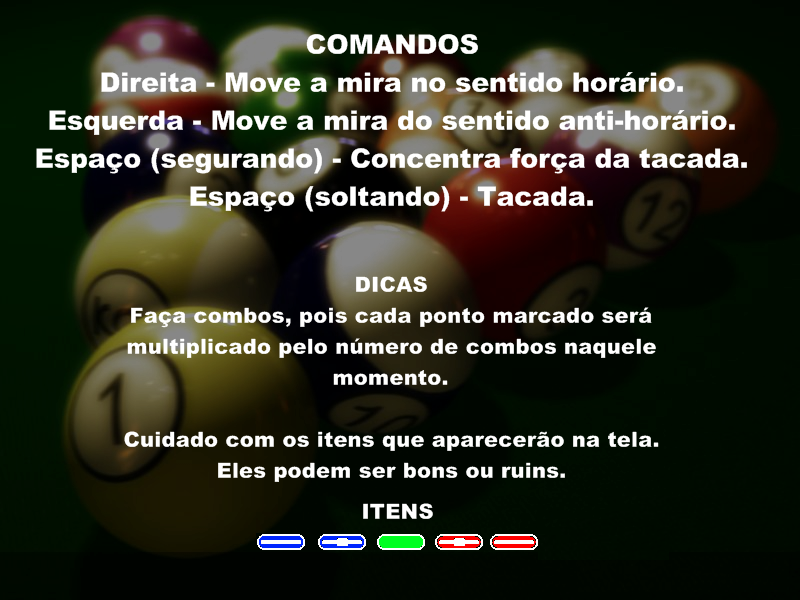

# Sinuca 

 :brazil:

A simple pooling game made in C++. This is a engineering graduation student project made with the purpose to learn about coding, game developing and OOP. 🎱

### Usage
Simply execute the **debug/Sinukoid.exe** file

### Limitations
As the execution file is a **.exe** file, it can only run in a windows environment and doesn't have a friendly interface.

### Authors
- [Demócrito d'Anunciação](https://github.com/democrito88)
- [Marcelo Lacerda](https://github.com/lacerdamarcelo)
- [Carlos Henrique]()
